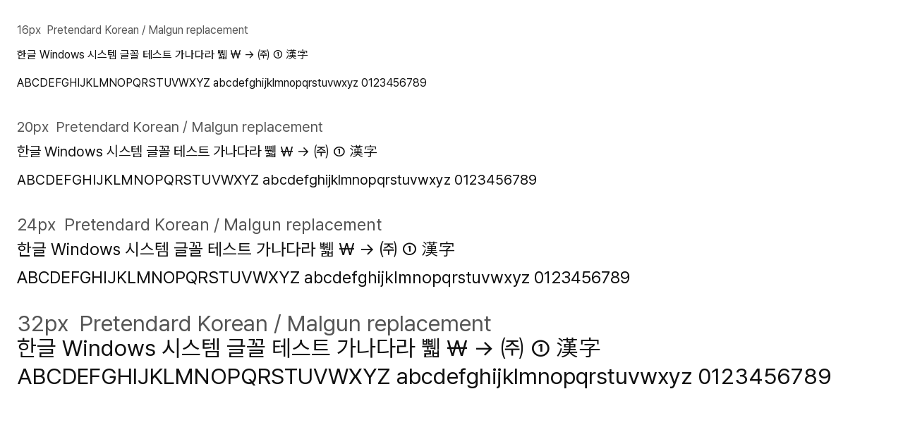

# 설치용 패키지 검증 (2026-10-02)

기존 builder와 journal 설치·복원을 재사용하여 apply/restore 명령을 추가했습니다. Python 3.12.14, FontTools 4.66.1, Windows 11 25H2 (26200.9457)에서 검증했습니다. **실제 시스템 글꼴 등록이나 재부팅 적용은 수행하지 않았습니다.**

- 기존 설치용 코드의 31개 테스트 및 독립 코드 검토를 완료했습니다. 이후 기존 GUI에 한국어 흐름을 연결하고 8개 검사를 추가하여 로컬 39개 테스트가 통과했습니다. 실제 CTk 창과 이벤트 루프에서 선택/Static 거절/빌드 실패 차단/적용 취소/상태 복원/권한 요청 취소/소스 복원 재실행/임시 적용·복원 및 공유 FontSubstitutes 차단을 검사합니다. 빌드 단계는 실제 plan 검사를 사용하며 느린 builder만 기존 synthetic 패키지로 대체합니다. 시스템 글꼴은 설치하지 않습니다.
- 공식 Pretendard Variable 1.3.9로 정적 9종 + 실제 weight 가변 Segoe UI Variable 1종 생성 성공. `--installable` 실제 CLI 빌드 exit 0.
- 10종 모두 완성형 한글 11,172자와 원본 UI 문자 유지. 원본 line metrics, style/weight/name, 파일 해시 검사.
- 실제 Variable 파일의 gvar/fvar, 원본 축 범위 및 15개 named instances와 STAT 확인. 300/325/350/375/400/500/600/650/700 굵기에서 외곽선 bounds 검사.
- 모든 설치용 출력의 Windows/hhea 세로 범위 초과 없음. 예외 윤곽을 세로로 조정한 결과이며 원래 디자인과 높이가 달라질 수 있습니다. 이는 문자 조판 후의 모든 조합이나 실제 UI 잘림까지 보장하는 것은 아닙니다.
- Windows GDI의 FR_PRIVATE 방식으로 10종을 테스트 프로세스에만 읽었습니다. 원본이 아닌 생성 파일의 unique name ID가 선택되고, 한글 11,172자가 실제 Windows glyph index로 매핑되는 것을 확인한 뒤 모두 해제했습니다. Variable의 Small/Text/Display 이름도 확인했습니다. [Microsoft의 FR_PRIVATE 설명](https://learn.microsoft.com/en-us/windows/win32/api/wingdi/nf-wingdi-addfontresourceexw)을 참고하세요.
- 실제 설치 전 계획 명령 exit 0. 현재 Windows 원본과 생성 파일의 해시, 명칭, 굵기, line metrics, Variable metadata 일치 및 출력 bounds 확인. Fonts/레지스트리 변경 없음.
- GUI/빌드 CLI/설치 CLI의 로컬 패키징 성공. 이 PC의 앱 제어가 자체 생성 EXE 실행을 차단하므로 EXE 실행은 미검증이고 Python 소스 CLI로 실행했습니다.
- 실패/부분 복사/재실행 복원 테스트 통과. Restore.reg를 먼저 보관합니다. 실제 파일 잠금·재부팅 후 Windows UI·실제 시스템 rollback은 미검증입니다.
- Emoji, MDL2, Fluent Icons 원본 파일의 작업 전후 SHA-256 동일.

[설치용 TTF 검증 JSON](installable-font-builds.json) · [읽기 전용 설치 계획](installable-plan.json) · [Windows private load 결과](windows-private-load.json)

## 제한

Pretendard는 opsz 디자인이 없으므로 Small/Text/Display 이름 및 opsz 좌표를 받되 같은 윤곽을 사용합니다. Variable 조판은 기본 굵기 GSUB/GPOS를 유지하며 굵기별 feature 선택과 kerning 보간은 재현하지 않습니다. 한자는 원본 맑은 고딕 보조 글리프일 수 있습니다. 이탤릭과 모든 Windows UI 표면을 통일하지는 않습니다. 보호된 Windows 원본 파일을 덮어쓰지 않으므로 원본 경로를 직접 읽는 UI는 바뀌지 않을 수 있습니다.

## 재현

[README의 적용·복원 방법](../../README.ko.md#실제-적용용-패키지와-설치복원)으로 설치용 패키지를 만든 뒤 `plan`을 실행합니다. Windows 프로세스 내부 폰트 검사만 재현하려면:

```powershell
.venv\Scripts\python.exe tests/windows_font_smoke.py "C:\temp\SyrianSegoe-Korean-installable"
.venv\Scripts\python.exe tests/windows_font_smoke.py "C:\temp\SyrianSegoe-Korean-installable" "Segoe UI Variable Small"
.venv\Scripts\python.exe tests/windows_font_smoke.py "C:\temp\SyrianSegoe-Korean-installable" "Segoe UI Variable Display"
```

## 파일 직접 읽기 샘플 (Windows UI 캡처 아님)

생성한 맑은 고딕 대체 파일을 Pillow/FreeType로 직접 읽어 16/20/24/32px로 확인했습니다.



## 이전 빌드 전용 검증 기록

아래 내용은 세로 조정을 적용하지 않은 이전 기본 빌드 전용 모드의 기록입니다. 설치용 출력과 구분하세요.

# 한국어 빌드 검증 결과

2026-10-02, Windows 11 25H2 (26200.9457), Python 3.12 환경에서 검증했습니다. 시스템 적용은 수행하지 않았습니다.

- 단위/회귀 테스트 24개 통과. cleanup 테스트는 FontForge API를 모사하며 실제 FontForge 실행 검증은 아닙니다.
- 공식 Pretendard 1.3.9 일반판 TTF 디렉터리와 Variable TTF 각각 9개, 총 18개 정적 TTF 생성 성공.
- 모든 출력에서 완성형 한글 11,172자, 입력의 한국어 문자 범위, 테스트 문자열의 cmap 및 글리프 존재 확인. FontTools 테이블 읽기/재컴파일 검증.
- Segoe UI 6종 및 Malgun Gothic 3종. 명칭, 굵기, 원본 hhea/OS2 세로 메트릭, 샘플 외곽선 및 해시를 font-builds.json에 기록.
- 한자는 필요할 때 원본 맑은 고딕을 보조로 사용하므로 모든 한자가 Pretendard 디자인이 되는 것은 아닙니다.
- 전체 외곽선의 세로 범위가 원본 Windows 메트릭을 넘는 출력이 있습니다. 일반판의 지정 테스트 문자열은 Windows 세로 범위 안에 있으나, 이것만으로 실제 UI의 잘림/행간을 보장하지 않습니다.
- Segoe UI Variable, 이탤릭 및 모든 Windows UI 표면의 지원은 검증하지 않았습니다. 한국어 경로는 build-only이며 자동 적용을 제공하지 않습니다.
- 기존 GUI의 백업 위치는 영구 Documents 폴더로 변경. 중간 레지스트리 실패, 부분 복사 실패, 재실행 복원은 임시 파일과 모사 레지스트리로 검증. 실제 시스템 rollback은 실행하지 않았습니다.
- GUI와 build-only CLI의 PyInstaller 패키징 검증. 이 PC의 Windows 애플리케이션 제어 정책이 생성 EXE 실행을 차단하여 EXE 실행 검증은 완료하지 못했습니다. Python 소스 CLI는 실행 성공했습니다.
- Fluent Icons / MDL2 / Emoji 원본 파일 해시는 작업 전후 동일했습니다.

## 제외한 파일

GitHub에는 소스, 테스트, 문서와 JSON 검증 기록만 저장합니다. Windows 원본 폰트, Windows 데이터를 병합한 출력 TTF, Pretendard 배포 파일 및 생성 EXE는 커밋하지 않습니다. 폰트 라이선스를 확인하고 사용자 PC의 원본에서 직접 빌드해야 합니다.

## 실제 적용 판단

현재 실제 적용을 권장하지 않습니다. 우선 가상 머신에서 한국어 UI와 전체 문자열의 잘림, 행간, 굵기, 로그인/설정/작업 표시줄을 검증하고 원본 복원을 시험해야 합니다. 본 작업 범위에서는 이러한 시스템 변경을 하지 않았습니다.
